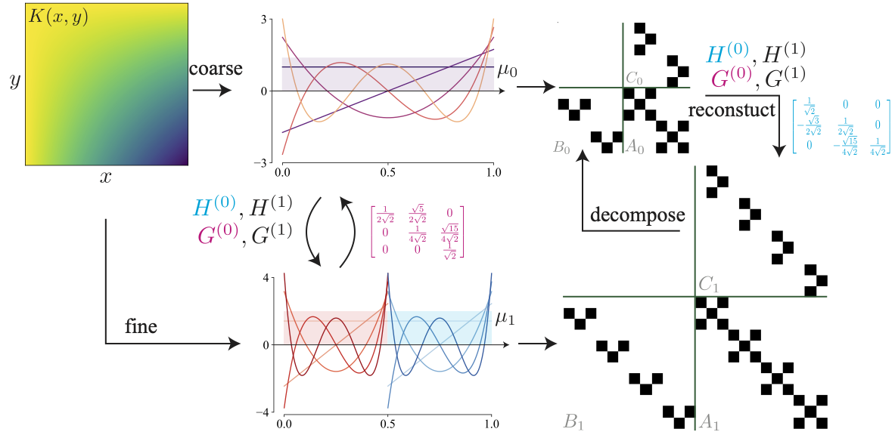

# Multiwavelet model for Operator maps


Gaurav Gupta, Xiongye Xiao, and Paul Bogdan\
**Multiwavelet-based Operator Learning for Differential Equations**


## Setup

### Requirements
The code package is developed using Python 3.8 and Pytorch 1.8 with cuda 11.0. For running the experiments first install the required packages using 'requirements.txt'

## Experiments
### Data
Generate the data using the scripts provided in the 'Data' directory. The scripts use Matlab 2018+. A sample generated dataset for KdV is uploaded at [KdV data](https://drive.google.com/drive/folders/1--KYHPjl-pkrrGRtH8eg0aG7q8hUjiKg).

For the experiments on Burgers, Darcy, and Navier Stokes, the code package uses the datasets as provided in the following repository by the Authors Zongyi Li et al.

[PDE datasets](https://drive.google.com/drive/folders/1UnbQh2WWc6knEHbLn-ZaXrKUZhp7pjt-)

### Scripts
Choose the required model from the `models` (1-d, 2-d, 2-d time-varying) and pass-in the required polynomial: 'legendre' or 'chebyshev'. Next, choose the desired value of multiwavelets 'k'.

### kDV
As an example, a complete pipeline is shown for the kDV equation in the attached `kDV.ipynb` notebook.

### Navier Stokes
The pre-trained models for Navier Stokes equation is provided using the following link:

[NS Pre trained](https://drive.google.com/drive/folders/1VDnz_8OdvfQYOneYQ2TFKryJ9Q6oXmnr)

A visual of time-evolution of the estimated outputs of the pre-trained models is available [Here](https://drive.google.com/drive/folders/1yLCy5C_z37nWP9H8LeFqY_4yLHuNnCmB?usp=sharing).

To test the model, first download the models to the 'ptmodels' directory. Next, 
For N=1000, T = 50, \nu = 1e-3 
``` 
python test_NS_MWT_N_1000.py
```
For N = 10000, T = 30, \nu = 1e-4
```
python test_NS_MWT_N_10000.py
``` 

**Note:** The NS experiments were done using Pytorch 1.7 cuda 11.0

## Citation
If you use this code, or our work, please cite:
```
@misc{gupta2021multiwavelet,
      title={Multiwavelet-based Operator Learning for Differential Equations}, 
      author={Gaurav Gupta and Xiongye Xiao and Paul Bogdan},
      year={2021},
      eprint={2109.13459},
      archivePrefix={arXiv},
      primaryClass={cs.LG}
}

```
